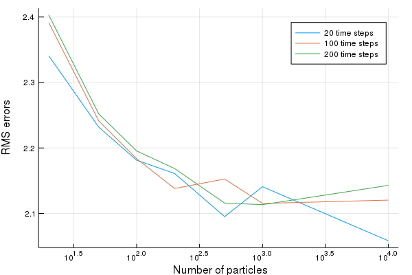
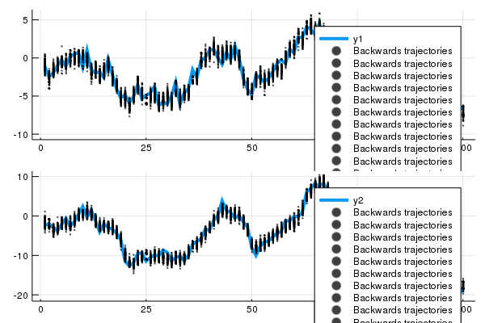

# LowLevelParticleFilters

[](https://travis-ci.org/baggepinnen/LowLevelParticleFilters.jl)

# Types
We provide three filter types
- `ParticleFilter`
- `AdvancedParticleFilter`
- `KalmanFilter`

All three can be used for filtering, smoothing and MCMC inference using the marginal Metropolis algorithm.

# Usage
Defining a particle filter is straight forward, one must define the distribution of the noise `df` in the dynamics function, `dynamics(x,u)` and the noise distribution `dg` in the measurement function `measurement(x)`. The distribution of the initial state `d0` must also be provided. An example for a linear Gaussian system is given below.
```julia
using LowLevelParticleFilters, StaticArrays, Distributions, RecursiveArrayTools, StatPlots

n = 2   # Dinemsion of state
m = 2   # Dinemsion of input
p = 2   # Dinemsion of measurements
N = 500 # Number of particles

df = MvNormal(n,1.0)          # Dynamics noise Distribution
dg = MvNormal(p,1.0)          # Measurement noise Distribution
d0 = MvNormal(randn(n),2.0)   # Initial state Distribution

# Define random linenar state-space system x' = Ax + Bu; y = Cx
Tr = randn(n,n)
const A = SMatrix{n,n}(Tr*diagm(linspace(0.5,0.99,n))/Tr)
const B = @SMatrix randn(n,m)
const C = @SMatrix randn(p,n)

dynamics(x,u)  = A*x .+ B*u
measurement(x) = C*x
pf = ParticleFilter(N, dynamics, measurement, df, dg, d0)
```

To see how the performance varies with the number of particles, we simulate several times
```julia

function run_test()
    particle_count = Int[20, 50, 100, 200, 500, 1000, 10_000]
    time_steps = Int[20, 100, 200]
    RMSE = zeros(length(particle_count),length(time_steps)) # Store the RMS errors
    propagated_particles = 0
    t = @elapsed for (Ti,T) = enumerate(time_steps)
        for (Ni,N) = enumerate(particle_count)
            montecarlo_runs = 2*maximum(particle_count)*maximum(time_steps) ÷ T ÷ N
            E = sum(1:montecarlo_runs) do mc_run
                pf = ParticleFilter(N, dynamics, measurement, df, dg, d0)
                u = randn(m)
                x = rand(d0)
                y = sample_measurement(pf,x,1)
                error = 0.0
                @inbounds for t = 1:T-1
                    pf(u, y) # Update the particle filter
                    x .= dynamics(x,u)
                    y .= sample_measurement(pf,x,t)
                    randn!(u)
                    error += sum(abs2,x-weigthed_mean(pf))
                end # t
                √(error/T)
            end # MC
            RMSE[Ni,Ti] = E/montecarlo_runs
            propagated_particles += montecarlo_runs*N*T
            @show N
        end # N
        @show T
    end # T
    println("Propagated $propagated_particles particles in $t seconds for an average of $(propagated_particles/t) particles per second")
    #
    return RMSE
end
RMSE = run_test()

# Plot results
time_steps     = [20, 100, 200]
particle_count = [20, 50, 100, 200, 500, 1000, 10_000]
nT             = length(time_steps)
leg            = reshape(["$(time_steps[i]) time steps" for i = 1:nT], 1,:)
plot(particle_count,RMSE,xscale=:log10, ylabel="RMS errors", xlabel=" Number of particles", lab=leg)
gui()
```


# Smoothing

We also provide a particle smoother, based on forward filtering, backward simulation (FFBS)
```julia
N     = 500 # Number of particles
T     = 200 # Number of time steps
M     = 100 # Number of smoothed backwards trajectories
pf    = ParticleFilter(N, dynamics, measurement, df, dg, d0)
du    = MvNormal(2,1) # Control input distribution
x,u,y = simulate(pf,T,du)


xb  = smooth(pf, M, u, y)
xbm = smoothed_mean(xb)
xbc = smoothed_cov(xb)
xbt = smoothed_trajs(xb)
xbs = [diag(xbc) for xbc in xbc] |> vecvec_to_mat .|> sqrt
plot(xbm', ribbon=2xbs, lab="Smoothed mean")
plot!(vecvec_to_mat(x), l=:dash, lab="True state")

plot(vecvec_to_mat(x), l=(4,), layout=(2,1), reuse=false, show=false, lab="True state")
scatter!(xbt[1,:,:]', subplot=1, show=false, lab="Backwards trajectories")
scatter!(xbt[2,:,:]', subplot=2, lab="Backwards trajectories")
```


# Parameter estimation
We provide som basic functionality for maximum likelihood estimation and MAP estimation

## ML estimation
Plot likelihood as function of the variance of the dynamics noise
```julia
svec = logspace(-2,2,50)
lls = map(svec) do s
    pfs = ParticleFilter(N, dynamics, measurement, MvNormal(n,s), dg, d0)
    loglik(pfs,u,y)
end
plot(svec, -lls, yscale=:log10, xscale=:log10, title="Negative log-likelihood", xlabel="Dynamics noise standard deviation")
```


as we can see, the result is quite noisy due to the stochastic nature of particle filtering.


## MAP estiamtion
To solve a MAP estimation problem, we need to define a function that takes a parameter vector and returns a particle filter
```julia
filter_from_parameters(θ) = ParticleFilter(N, dynamics, measurement, MvNormal(n,θ[1]), MvNormal(p,θ[2]), d0)
```
we also need to define prior distributions for all parameters in the parameter vector

```julia
priors = [Distributions.Gamma(1,10),Distributions.Gamma(1,10)]
plot_priors(priors, xscale=:log10, yscale=:log10)
```
Now we call the function `log_likelihood_fun` that returns a function to be minimized
```julia
averaging = 3
ll       = log_likelihood_fun(filter_from_parameters,priors,u,y,averaging)
```
the parameter `averaging >= 1` can be set to reduce the Monte-Carlo error associated with estimating log likelihood by and SMC method. Oftentimes is is better to increase the number of particles instead.

We can optimize `ll(θ)` with our favourite optimizer, e.g.,
```julia
using Optim
initial_θ_guess = [2.0, 2.0]
res = optimize(θ -> -ll(θ), initial_θ_guess, show_trace=true, iterations=50)
@show res
θ   = Optim.minimizer(res)
pfθ = filter_from_parameters(θ)
```
```julia
res = Results of Optimization Algorithm
 * Algorithm: Nelder-Mead
 * Starting Point: [2.0,2.0]
 * Minimizer: [1.975160015361007,0.9439091703520719]
 * Minimum: 1.060930e+03
 * Iterations: 50
 * Convergence: false
   *  √(Σ(yᵢ-ȳ)²)/n < 1.0e-08: false
   * Reached Maximum Number of Iterations: true
 * Objective Calls: 142
```

Standard tricks apply, such as performing the parameter search in log-space and using global/black box methods, see e.g. [BlackBoxOptim.jl](https://github.com/robertfeldt/BlackBoxOptim.jl)
